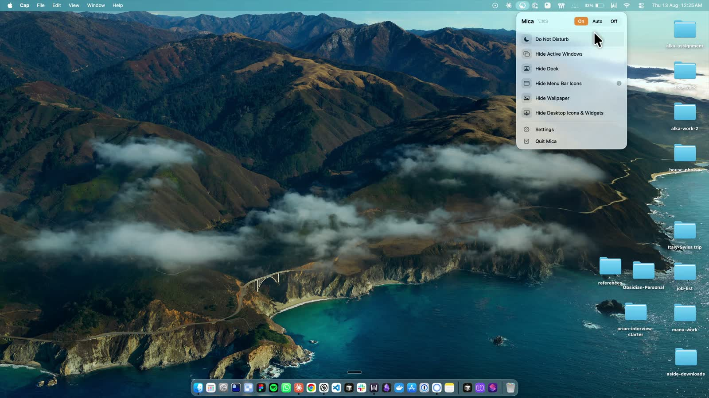
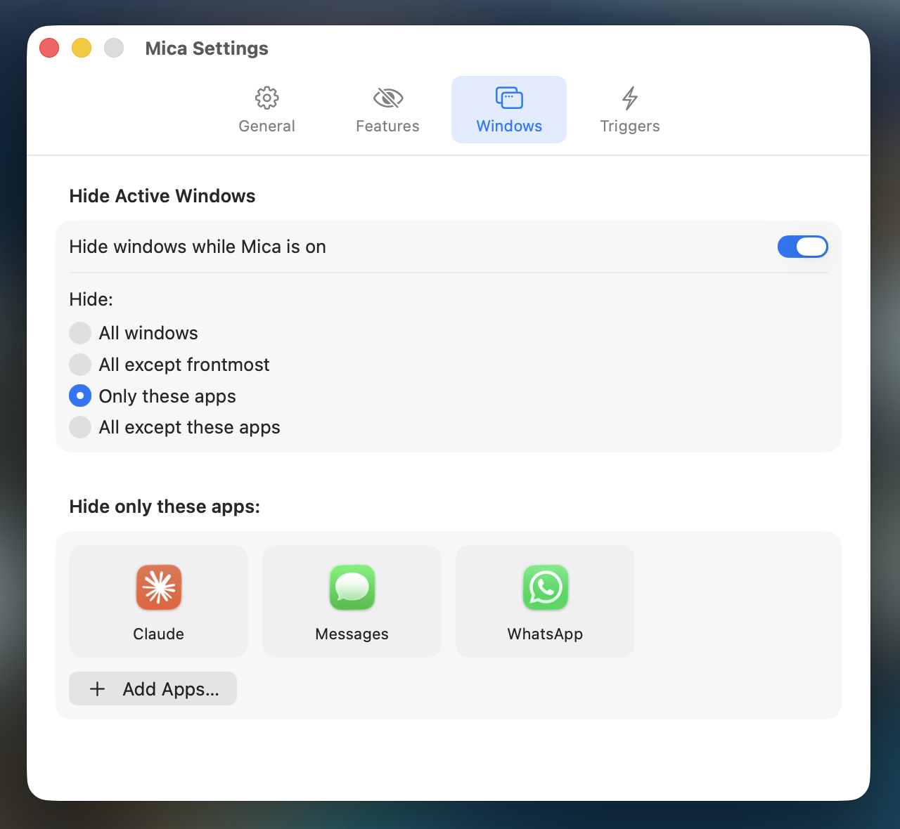
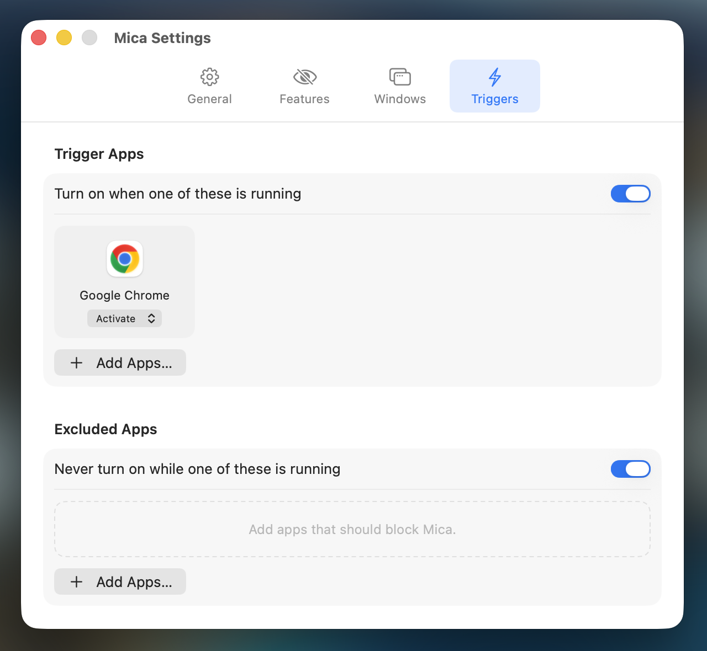

# Mica

A macOS menu bar app that hides your desktop before anyone else sees it. Press Option-Command-S, or let it turn on by itself when your screen starts being shared or recorded. Mica silences notifications and hides your windows, Dock, menu bar icons, wallpaper, and desktop icons. When the call ends, it puts everything back the way it was.

[Download](https://github.com/Vedant-29/mica/releases/latest/download/Mica.dmg) · [All releases](https://github.com/Vedant-29/mica/releases) · [Website](https://mica.vedantagrw.com)

Related: [mica-web](https://github.com/Vedant-29/mica-web) (the landing page at mica.vedantagrw.com)

A free, open-source, non-sandboxed alternative to [Stealthly](https://stealthly.app/). Mica makes no network calls and needs no accounts or API keys.

[](docs/reveal.mp4)

Click the image to watch the demo video.

## Features

- Do Not Disturb for the duration of a call
- Hide windows: all, all except the frontmost, only apps you pick, or all except apps you pick
- Hide the Dock, menu bar icons, wallpaper, and desktop icons and widgets
- Three modes: On, Off, and Auto
- Auto turns on when screen sharing or recording starts, a display is mirrored or extended, a trigger app launches, or a scheduled time window begins. An excluded app blocks it.
- Crash safe: prior state is saved to disk first and restored on the next launch if Mica is killed

<p>
  
  
  
</p>

## Requirements

- macOS 15 or later (developed and tested only on macOS 26.6 Tahoe)
- Swift 6.2 (Xcode 26 or later) to build from source

## Install

Download `Mica.dmg` from the latest release and drag Mica to Applications. The build is signed but not notarized, so right-click the app and choose Open the first time (or run `xattr -cr /Applications/Mica.app`). Each release also ships a `.sha256` checksum.

## Build from source

```sh
git clone https://github.com/Vedant-29/mica.git
cd mica
make install   # build and install to /Applications
make run       # install and launch
make test      # run the tests
make dmg       # build a drag-to-Applications disk image in dist/
```

No paid Apple Developer account is needed. Always launch from `/Applications`, not the built binary from a shell, or macOS gives the permissions to your terminal instead of Mica.

By default the app is ad-hoc signed, so permission grants reset on every install. To keep them, copy `Local.mk.example` to `Local.mk` and set a stable identity:

```make
SIGN_IDENTITY = Apple Development: Your Name (TEAMID)
```

List identities with `security find-identity -v -p codesigning`. Run `make verify` to check the signature; if it prints a `cdhash`, signing fell back to ad-hoc. `Local.mk` is gitignored. If you fork the app, also set your own `BUNDLE_ID` there.

To remove the app, run `make uninstall`. To clear the permission grants macOS holds for it, run `make reset-tcc`.

## First run

Mica needs no Accessibility, Screen Recording, or Full Disk Access permission. A few things are still up to you:

1. Do Not Disturb (optional). macOS 26 has no API to turn Focus on, so Mica runs two Shortcuts you create once. In the Shortcuts app, make a shortcut with the Set Focus action (Do Not Disturb, On) named exactly `Mica Do Not Disturb On`, and another set to Off named exactly `Mica Do Not Disturb Off`. Then press Test in Mica > Settings > Features.
2. Hide Menu Bar Icons (optional). Hold Command and drag Mica's `‹` marker in the menu bar to where you want the cut-off. Everything to its left hides.
3. If Mica's icon does not appear on macOS 26, allow it in System Settings > Control Center > Menu Bar.

Settings open from the menu bar icon, or by URL:

```sh
open mica://settings   # also mica://windows, mica://features, mica://triggers
```

## Releasing

`VERSION` is the source of truth. Run:

```sh
make release BUMP=patch   # or minor / major
```

This bumps `VERSION`, commits, tags `vX.Y.Z`, and pushes. GitHub Actions (`.github/workflows/release.yml`) runs the tests, builds a signed DMG, and publishes a release with `Mica.dmg` and its `.sha256`. The workflow fails if the tag and `VERSION` disagree, so do not edit `VERSION` or create tags by hand. A tag with a hyphen (`v0.3.0-rc1`) is published as a prerelease. The website needs no redeploy because its download link always points to the latest release.

The release job signs with a certificate stored in the repository. If you fork the app, set your own:

| Name | Kind | What it is for | Where to get it |
|---|---|---|---|
| `MACOS_CERT_P12` | Secret | Base64 `.p12` of your signing identity plus its WWDR intermediate | Export from Keychain Access, then `base64 -i cert.p12` |
| `MACOS_CERT_PASSWORD` | Secret | The `.p12` export password | Set when exporting |
| `SIGN_TEAM_ID` | Variable (optional) | Team ID used to pick the identity in CI. If unset, the first Apple identity in the `.p12` is used | The code in parentheses in the identity name, from `security find-identity -v -p codesigning` |

Without `MACOS_CERT_P12` the release is ad-hoc signed and users re-grant permissions on every update. Forks should also change `BUNDLE_ID` in `release.yml`, which is set to `com.vedant.mica`. Use the same certificate locally and in CI, or local and CI builds carry different signatures.

## Notes

- Reminders use Mica's own banner. macOS only grants notification access to notarized Developer ID apps.
- Some Apple-internal screen captures are not counted by the window server, so Mica cannot detect them.
- Only menu bar icons can be hidden, not the whole menu bar, because macOS 26 reads that setting at login.
- Dock and screen capture detection use private APIs (`CoreDockSetAutoHideEnabled`, `CGSIsScreenWatcherPresent`), which may change between macOS versions.
- After a reboot, crash recovery skips restoring windows, since hidden-app state does not survive a restart.
- The app is signed with a free Apple Development certificate, which lasts a year. Renewing it changes the signature, so every user re-grants permissions once.

## Credits

- [KeyboardShortcuts](https://github.com/sindresorhus/KeyboardShortcuts) by Sindre Sorhus for the global hotkey and its recorder
- [MenuBarExtraAccess](https://github.com/orchetect/MenuBarExtraAccess) by orchetect for reaching the menu bar item from SwiftUI

## License

MIT. See [LICENSE](LICENSE).
